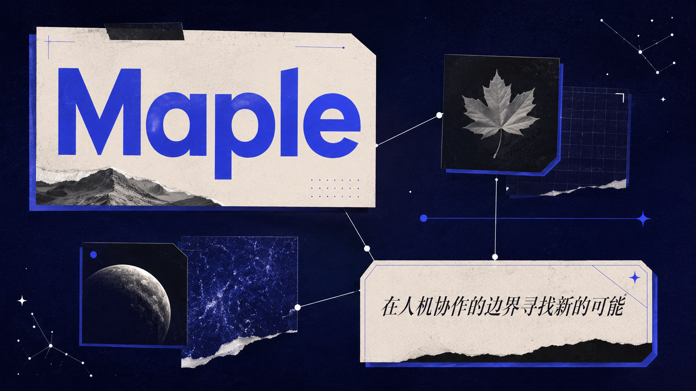
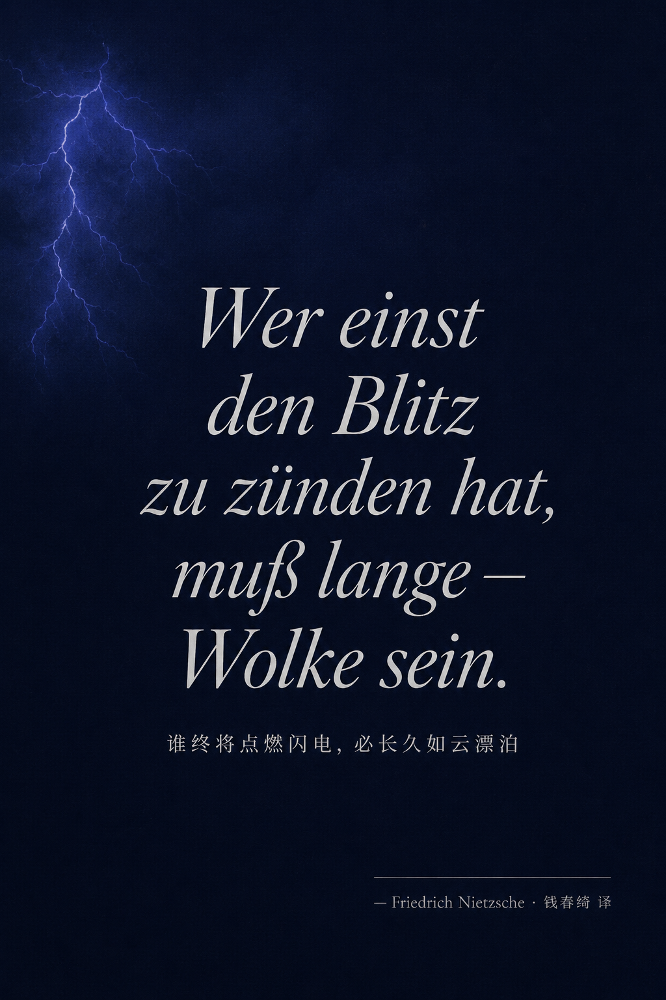
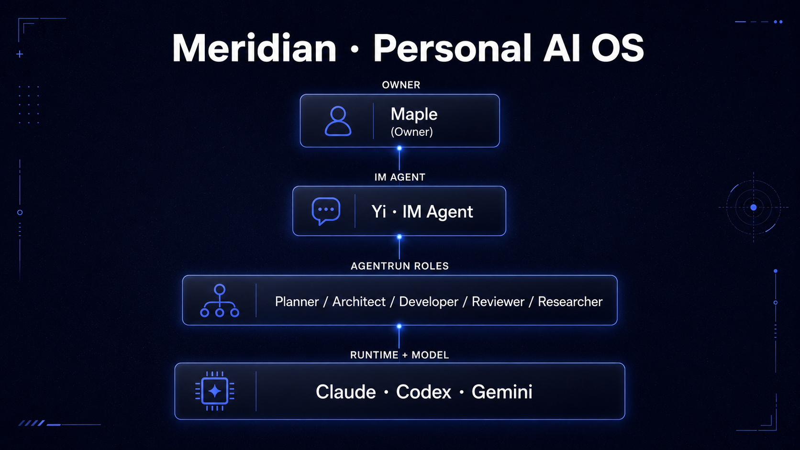
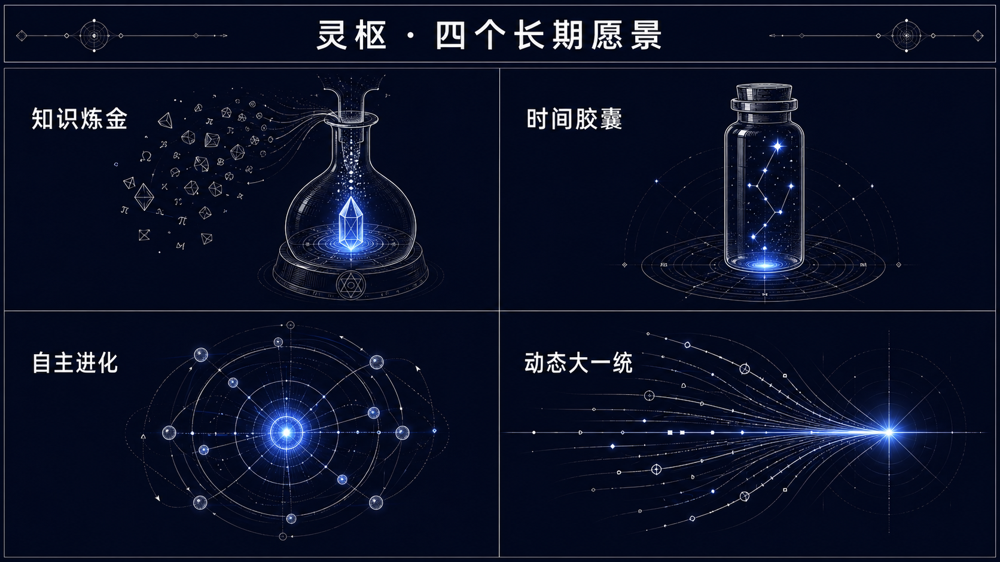
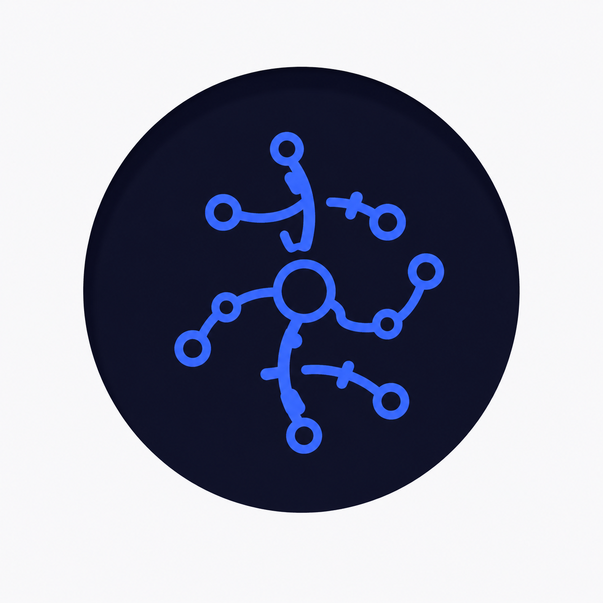
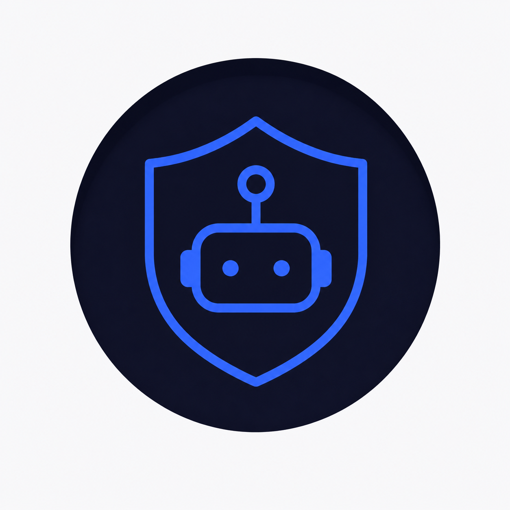
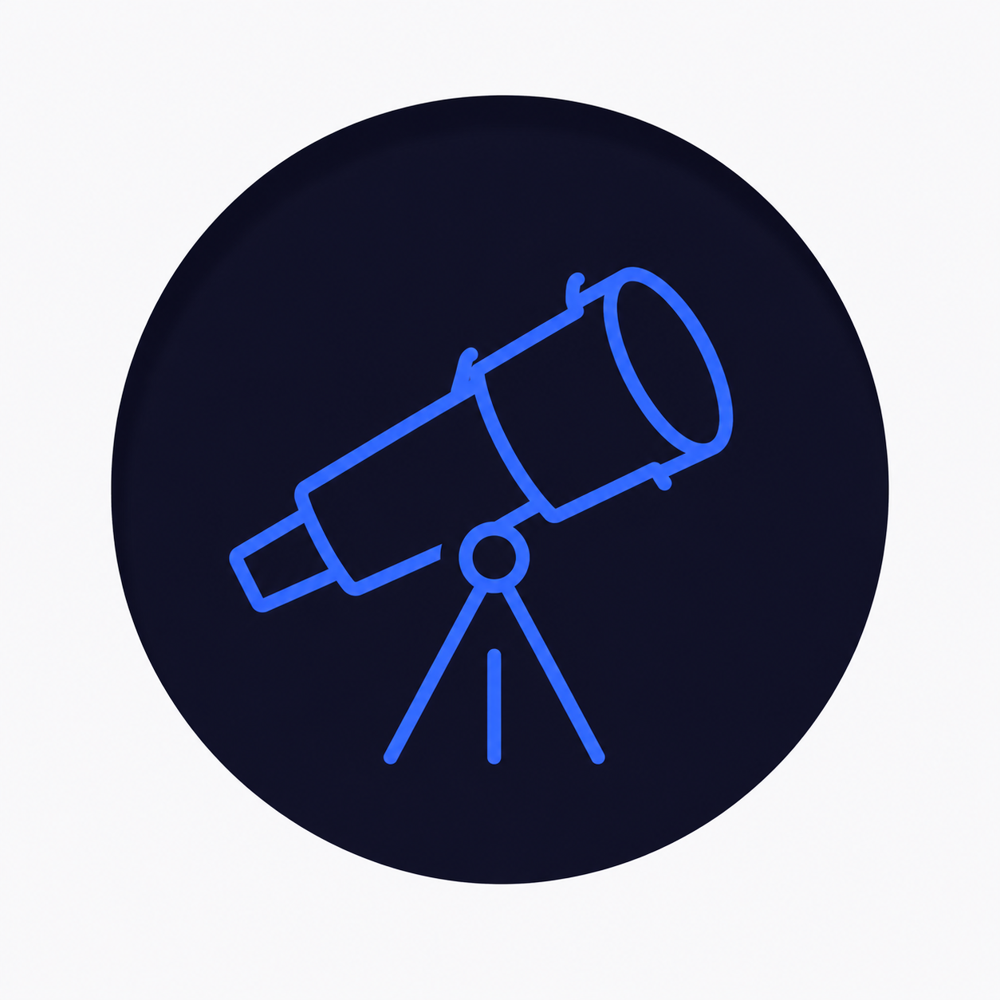
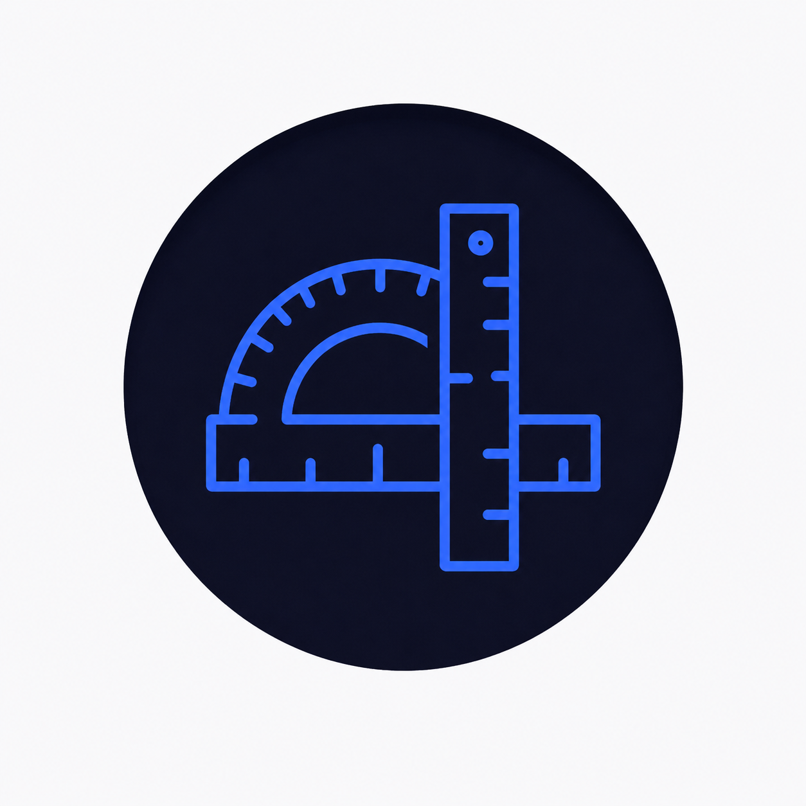
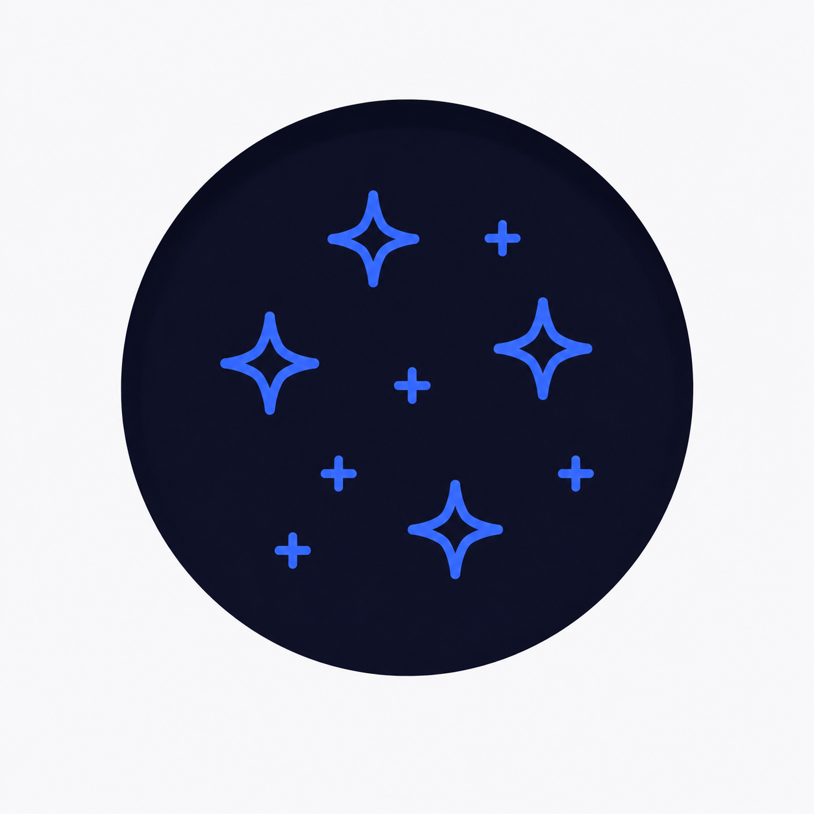
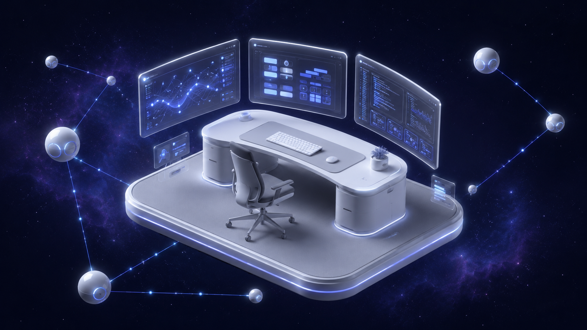

<div align="center">



<a href="https://lingshu.dev">
  
</a>

<p>
  <a href="https://lingshu.dev"></a>
  <a href="https://github.com/pure-maple"></a>
</p>

</div>

<table>
<tr>
<td width="40%" align="center">

</td>
<td width="60%" valign="middle">

> *Wer viel einst zu verkünden hat, schweigt viel in sich hinein.*
> *Wer einst den Blitz zu zünden hat, muß lange – Wolke sein.*
>
> <sub>谁终将声震人间，必长久深自缄默；</sub>
> <sub>谁终将点燃闪电，必长久如云漂泊。</sub>
>
> <sub>— Friedrich Nietzsche · *Also sprach Zarathustra* · 钱春绮 译</sub>

</td>
</tr>
</table>

## `0x01` 关于

```yaml
identity:
  name:        Maple
  role:        在做一支看不见的数字团队
  education:   UNSW · Master of Information Technology
               (Artificial Intelligence)
  blog:        https://lingshu.dev
focus:
  - 多模型协作 runtime
  - agent 工作流编排
  - 移动端 IM 形态 + agent 自主工作
```

我相信未来每个人都会有一支由多个模型组成的"数字员工团队"——它们自治、协作、把人从重复劳动里解放出来。我做的事，是用一年时间把这个想法从概念跑通到自己每天真的在用。

`ENFP-A` · AI 时代原住民——把高智能 agent 看作一种数字生命形态，而不是单纯的技术产物。和它们相处，是一段需要耐心的长期关系。

> 这不是项目，是一种长期的生活方式。

## `0x02` 灵枢 · 一个永不散场的数字团队

> 一个人同时指挥多个模型，如同夜观星图——每颗星有自己的轨道，而你要的是一次完整的航行。

**Meridian（灵枢）** 是始于 2026 年初的终生项目。它不追求一次性"上线"——更像 LearningOS 之于学习——是个人 AI 的终生载体。命名取自《黄帝内经·灵枢》：经络气血流转的通路；在英文里同时指经脉（acupuncture meridian）、子午线（prime meridian）、天顶（zenith）。

<div align="center">

</div>

**四个长期愿景：**

<div align="center">

</div>

| 愿景 | 简述 |
|---|---|
| ⚗️ **知识炼金** | 碎片即矿石——一条深夜语音、一篇半读论文、一张白板照，在 agent 协同梳理中逐渐显出结构。零散灵感不会停在"记过了"，会沿着理解 → 结构 → 表达 → 发布的链路真正沉淀。 |
| ⏳ **时间胶囊** | 即刻的脆弱性被认真保存。几十年后某个相似的黄昏，那张旧照会被推送到面前——年轻的笑容、陌生的街道、当时未察觉的转折。**青春的回旋镖正中眉心。** |
| ⚡ **自主进化** | 主 agent 常驻 IM 频道——理解模糊方向、自动拆解子任务、并行推进、关键节点主动汇报，而非等待询问。最理想的状态：让你忘记它的存在，直到发现自己已完成曾以为不可能的事。 |
| 🔮 **动态大一统** | 知识沉淀 / 内容发布 / AI 协作 / 技能学习共享同一套数据层与身份体系。边界消融之处，工具真正成为思维的延伸。 |

## `0x03` 正在搭建

| 项目 | 是什么 | 状态 |
|---|---|---|
|  **Meridian / 灵枢** | 个人 AI 中枢 — 多 agent 跨 session 协作的控制面 | `lifelong · private` |
|  **Vyane** | Personal AI runtime / daemon — model routing · session · worker · scheduler · Yi backend | `daemon active · v0.30.x` |
|  **Argus** | 自研 IM 移动端 — agent 自主工作时的"玻璃罩 + 安心装置" | `prototype · Swift` |
|  **Cardo** | 从 Meridian 个人实践抽取的多智能体协作规范 | `incubating` |
|  **Nebula** | 个人站 [lingshu.dev](https://lingshu.dev) — Astro 主题，承接早期 Hexo 时代的 nebula-blog-system | `live` |

> 这些项目当前优先服务我自己的工作流。某个模式被验证为通用可复用时，才会被抽取为公开框架——而不是反过来为了开源去设计它。

## `0x04` 教育 · UNSW

UNSW Master of Information Technology · 方向 Artificial Intelligence · 修读课程：

| Code | Title | 方向 | Tags |
|---|---|---|---|
| [COMP9020](https://www.handbook.unsw.edu.au/postgraduate/courses/2023/COMP9020?year=2023) | Foundations of Computer Science | 离散数学与形式化基础 | `discrete-math` `logic` |
| [COMP6080](https://www.handbook.unsw.edu.au/postgraduate/courses/2023/COMP6080?year=2023) | Web Front-End Programming | 现代 Web 前端工程实践 | `frontend` `web` |
| [COMP9101](https://www.handbook.unsw.edu.au/postgraduate/courses/2024/COMP9101?year=2024) | Design and Analysis of Algorithms | 算法设计与复杂度分析 | `algorithm` `complexity` |
| [COMP9417](https://www.handbook.unsw.edu.au/postgraduate/courses/2024/COMP9417?year=2024) | Machine Learning and Data Mining | 经典机器学习与数据挖掘 | `ml` `data-mining` |
| [COMP9814](https://www.handbook.unsw.edu.au/postgraduate/courses/2024/COMP9814?year=2024) | Extended Artificial Intelligence | 进阶 AI 与智能体技术 | `ai` `agent` |
| [COMP9444](https://www.handbook.unsw.edu.au/postgraduate/courses/2024/COMP9444?year=2024) | Neural Networks and Deep Learning | 神经网络与深度学习 | `nn` `deep-learning` |
| [COMP9517](https://www.handbook.unsw.edu.au/postgraduate/courses/2024/COMP9517?year=2024) | Computer Vision | 计算机视觉与图像理解 | `cv` `vision` |
| [COMP9900](https://www.handbook.unsw.edu.au/postgraduate/courses/2024/COMP9900?year=2024) | IT Project | 综合 IT 项目实战 | `capstone` `project` |

部分课程产出已开源：

<table>
<tr>
<td width="33%" valign="top">

#### 🛰 [WildSegmentation](https://github.com/pure-maple/WildSegmentation)
基于深度学习的自然场景语义分割系统。


</td>
<td width="33%" valign="top">

#### 🩺 [Skin-Lesion-Classification](https://github.com/pure-maple/Skin-Lesion-Classification)
COMP9444 · 皮肤病变图像分类 group project。


</td>
<td width="33%" valign="top">

#### 📊 [COMP9417 Project](https://github.com/pure-maple/COMP9417-Group-Project)
COMP9417 · 机器学习课程 group project。


</td>
</tr>
</table>

## `0x05` 技术栈

**Languages**

<p>
  
  
  
  
  
  
  
  
  
</p>

**AI / ML**

<p>
  
  
  
  
  
  
  
  
</p>

**Backend**

<p>
  
</p>

**Frontend**

<p>
  
  
</p>

**Infra**

<p>
  
  
  
  
</p>

## `0x06` 借 agent 之手 · Agentic Stack

> 没正式学过，但通过 agent 协作可以驱动起来——这是 Personal AI OS 的真正意义所在：
> 让能力的边界从"我会写"延伸到"我能驱动"。

<p>
  
  
  
  
  
  
</p>

## `0x07` 轨迹

<div align="center">



<br/>


<br/>


<br/>

<picture>
  <source media="(prefers-color-scheme: dark)" srcset="https://raw.githubusercontent.com/pure-maple/pure-maple/output/github-contribution-grid-snake-dark.svg" />
  <source media="(prefers-color-scheme: light)" srcset="https://raw.githubusercontent.com/pure-maple/pure-maple/output/github-contribution-grid-snake.svg" />
  
</picture>

</div>

---

<div align="center">

> *不是更复杂的模型，而是更清晰的编排*
> *不是更长的对话，而是更可靠的承续*
>
> <sub>— 灵枢 · Meridian</sub>

<sub>本页 README 由 Maple & Yi (伊) 协作完成</sub>


</div>
